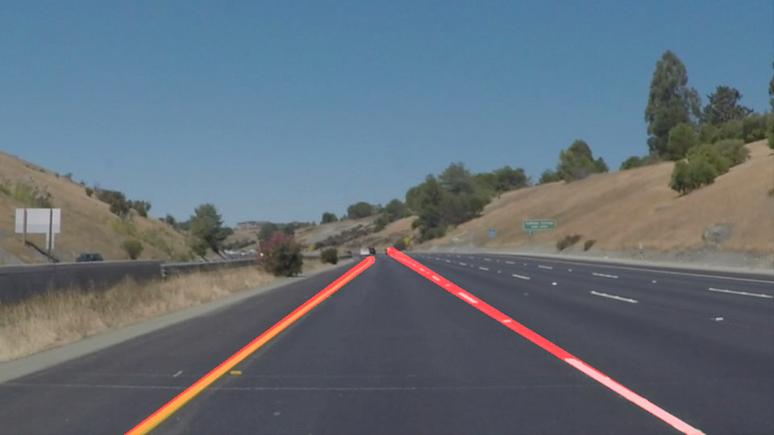
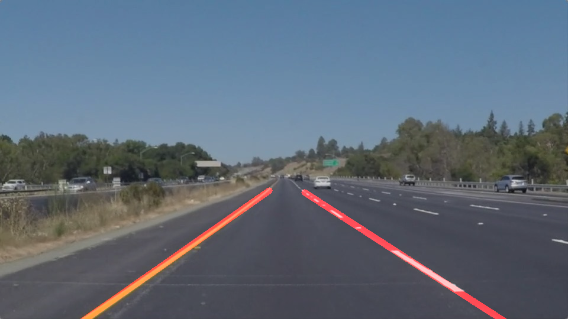
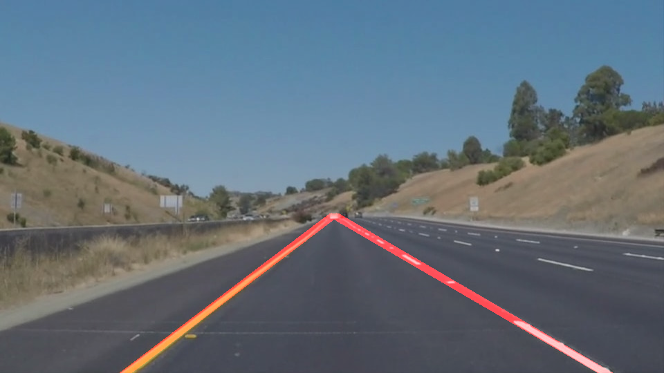

# **Finding Lane Lines on the Road** 
[](http://www.udacity.com/drive)

Overview
---
 The lines on the road act as our constant reference for where to steer the vehicle.  The aim of this project is to develop a self-driving car autmatic lane detection system using Python and OpenCV. A pipeline processing is applied to a series of individual images and ultimately to a video stream.

## Expected Output


## Requirements

- Anaconda with Python 3 (Which internally includes all the other requirements)
- jupyter


## Setup

```
- git clone https://github.com/Mohit-Ak/CarND-LaneLines-P1.git
- cd CarND-LaneLines-P1
- For CPU
- conda env create -f environment.yml
- For GPU
- source activate carnd-term1
- jupyter notebook Lane_Detection_Project.ipynb

```
## Pipeline


## Output Images
---
The test images are located under - test_images
### solidWhiteCurve


### solidWhiteRight


### solidYellowCurve


### solidYellowCurve2


### solidYellowLeft


### whiteCarLaneSwitch


## Output Videos
---
Test Videos are located under - test_videos
Test Videos output are located under - test_videos_output

### Conclusion
Thus, we successfully apply various image processing techniques in a pipeline to mark the driving lanes in a color agnostic manner within the region of interest.

###  Current Shortcomings

- Not robust to image size.
- Not robust to image resolution.
- I am from Buffalo and found a peculiar issue where the algorith does not differentiate Snow trails from Lane Markings.
- Algorithm dpes not work on sharp curves / hairpin bends.
- Not robust to the alignment of camera.
- Steep roads will be an issue because the line of the horizon shifts.


### Suggest possible improvements to your pipeline

- Normalize the image so that the algortithm becomes size agnostic.
- Detect the horizon (line between the sky and the earth) and determine the points for the new ROI.
- To to determine the vertices of ROI polygon automatically.
- ROI to be changed dynamically every frame.
- Identify other markings within the lane.

