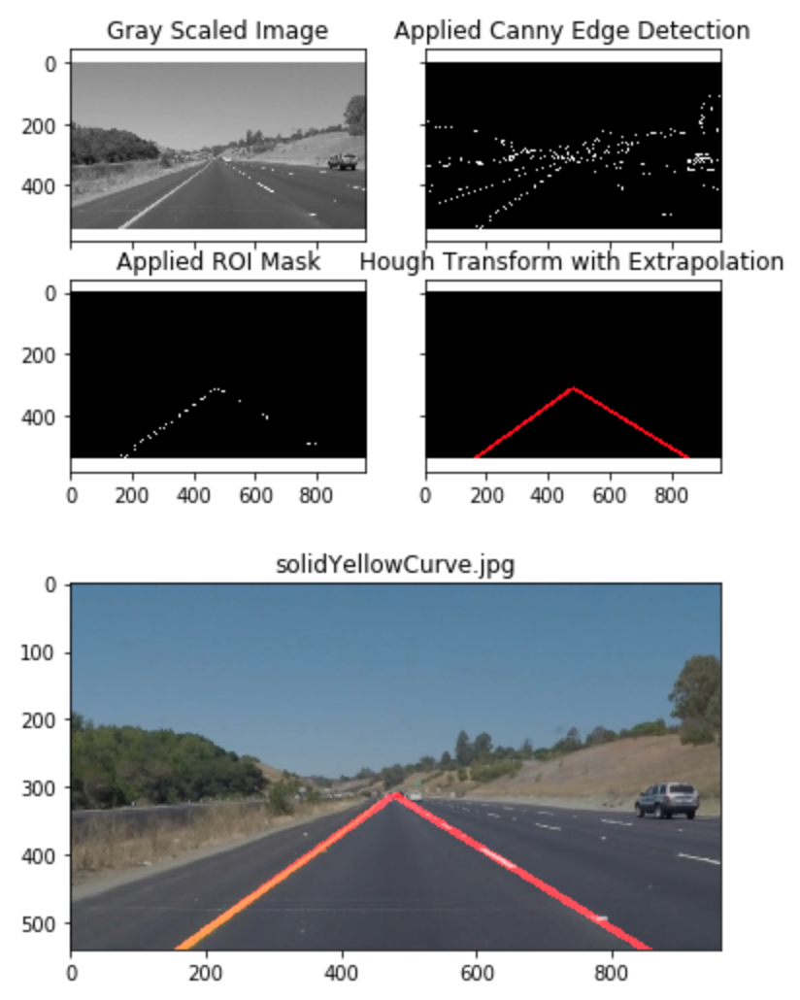
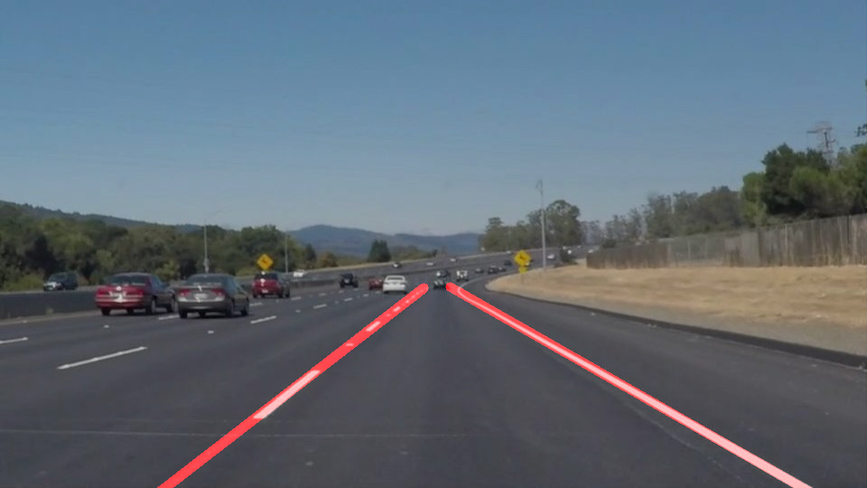
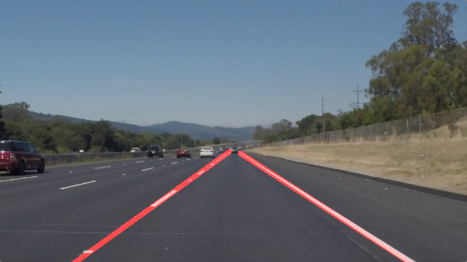
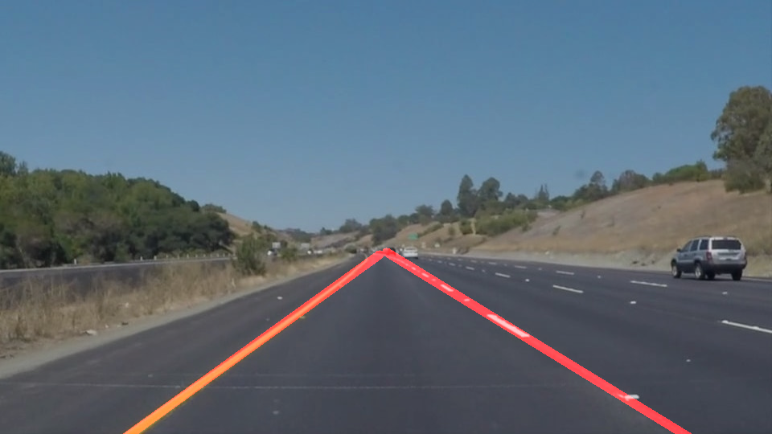
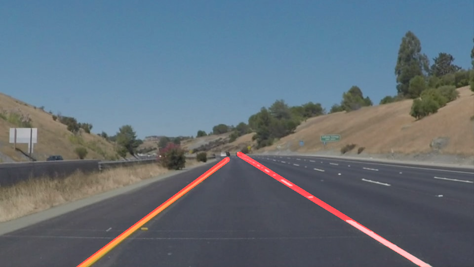
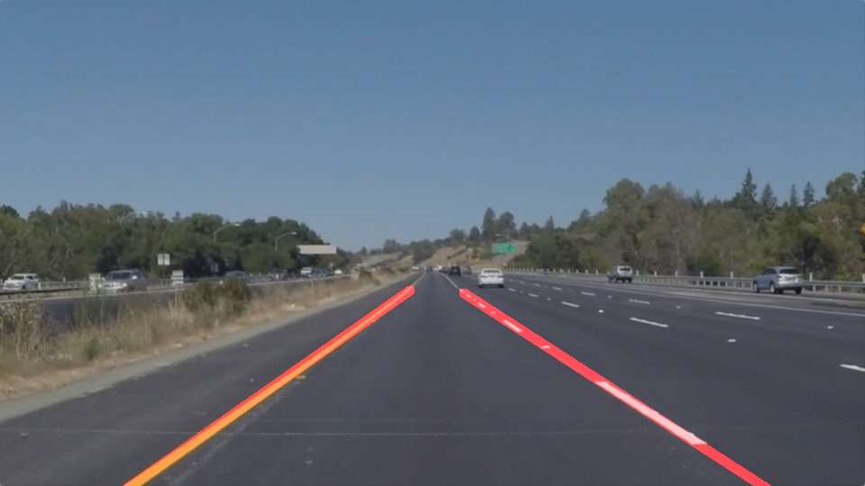
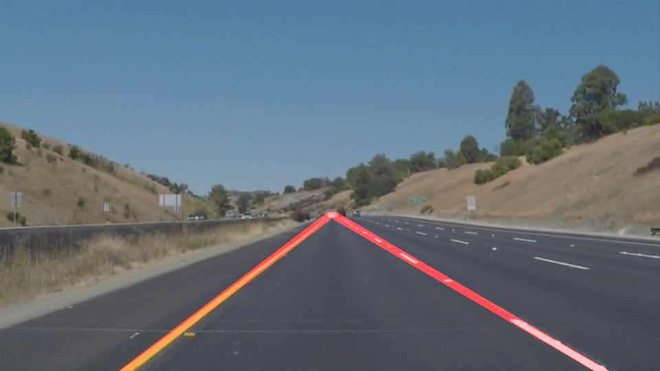

# **Finding Lane Lines on the Road** 

### The project has been implemented to identify lane lines on the road. A pipeline processing is applied to a series of individual images and ultimately to a video stream. All the images from "test_images" are read and and processed. All videos from "test_videos" directory are read and processed. Ultimately, one line is drawn for the left side of the lane, and one for the right hand side. The corresponding outputs are written to test_images_output and test_videos_output directory.

---

### 1. Pipeline Steps
- Converted the images to grayscale
- Applied explicit Gaussian vlur with kernel size of three
- Applied Canny Edge Detecion to find out the points belonging to the edges with low threshold of 50 and high threshold of 150.
- Created a polygon mask for extracting the region of interest(ROI) with the folowing vertices ([[0,height],[470, 315], [490, 315], [width,height])
- Applied Hough transform to obtain lines.
- Modified the draw_lines() function to obtain a single line on the left and right lanes.
- Divided the all the lines into left [or] right.
- Filtered the horizontal lines or lines with infinite slope( x2-x1 = 0).
- Found the upper most and lower most points in each of the left and right lines by substituting the points in the polyfit 1D line equation(Eqn with b and m).
- Draw the lines on an empty image.
- Perform a weighted merge of the image over the input image.
- Write the final image / video.

 

### Pipeline Image

### 2. Output Images
---
The test images are located under - test_images
### solidWhiteCurve

### solidWhiteRight

### solidYellowCurve

### solidYellowCurve2

### solidYellowLeft

### whiteCarLaneSwitch

## 3. Output Videos
---
- Test Videos are located under : test_videos
- Test Videos output are located under : test_videos_output

### 4. Conclusion
Thus, we successfully apply various image processing techniques in a pipeline to mark the driving lanes in a color agnostic manner within the region of interest.

### 5. Current Shortcomings

- Not robust to image size.
- Not robust to image resolution.
- I am from Buffalo and found a peculiar issue where the algorith does not differentiate Snow trails from Lane Markings.
- Algorithm dpes not work on sharp curves / hairpin bends.
- Not robust to the alignment of camera.
- Steep roads will be an issue because the line of the horizon shifts.

### 6. Suggest possible improvements to your pipeline

- Normalize the image so that the algortithm becomes size agnostic.
- Detect the horizon (line between the sky and the earth) and determine the points for the new ROI.
- To to determine the vertices of ROI polygon automatically.
- ROI to be changed dynamically every frame.
- Identify other markings within the lane.
